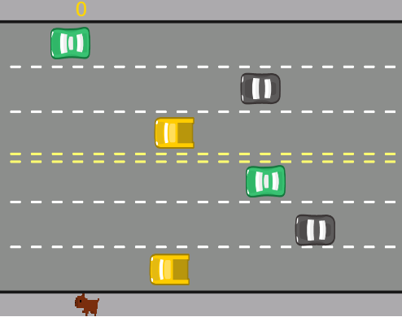

<h1 align = "center"> Freeway <h1>
<h3 align = "center"> By SrBieelx <h3>

Jogo feito com ajuda da Alura e seu curso de JavaScript e HTML: desenvolva um jogo e pratique lógica de programação.  

## 🚀 Tecnologias

Esse projeto foi desenvolvido com as seguintes tecnologias:
- JavaScript
- HTML

## 💻 Projeto
Esse jogo foi baseado no clássico de Atari Freeway

